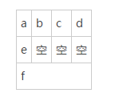

## 1、主函数main也有参数：int main(int argc,char **argv)
## 2、下面关于delete描述错误的是（）

> A 他必须用于new返回的指针 <br>
> B 使用他删除对象时要调用[析构函数](#析构函数) <br>
> C 对一个指针可以使用多次该运算符 <br>
> D 指针名前只有一对方括号符号，不管所删除数组的维数
```text
答案：C，不能对一个指针进行多次delete，对一个指针delete之后，它所指向的那片内存已经被回收，可能会分配用于其他数据，如果再次delete则会导致数据丢失。
delete用于释放new的创建的内存，delete[] 用于释放new创建的数组内存。
使用delete释放的对象内存时会调用对象的（隐士调用）析构函数。
```

## 4、在32位平台上

```
struct {
	unsigned char a;
    int b;
    short c
} s;
```

请问s的起始地址下面说法正确的是（）

> 答案：四字节对齐

```
struct STUDENT
{
    char a;
    char b;
    char c;
    char d;
    char e;
    int f;
}data;
```




## 5、在64位机器上sizeof(a) sizeof(b)大小分别是（）

```
char a[10];
char *b = (char*)malloc(10*sizeof(char));
```

> 答案： 64位系统中，指针占8个字节，32位系统中，指针占4个字节。 
>
>   a是一个字符数组，大小为10*sizeof(char)，占10字节。

## 6、下列运算符中优先级最高的是（ ）

> A <  
>
> B +  
>
> C &&
>
> D !=

> 答案：B
>  <是6级, +是4级, &&是11级, !=是7级 所以加号的优先级最高。
>
> ！ > 算术运算符 > 关系运算符 > && > || > 赋值运算符
>
> 算术运算符： +  -  *  /  %  ^  ！ ···
> 关系运算符(6个)： ==  !=  >  >=  <  <=
> 赋值运算符： =  +=  -=  *=  /=  %= ···
> 逻辑运算符：&&  ||
>
>   淡云一笔，鞍落三服 
>
>   (单目)(算术)(移位)(比较),(按位)(逻辑)(三目)(赋值) 

| 优先级 | 运算符                              | 结合性   | 名称 |
| ------ | ----------------------------------- | -------- | ---- |
| 1      | `() [] -> .`                        | 从左到右 |      |
| 2      | `++ -- + - ! ~ & * (type) sizeof`   | 从右到左 |      |
| 3      | `* / %`                             | 从左到右 |      |
| 4      | `+ -`                               | 从左到右 |      |
| 5      | `<< >>`                             | 从左到右 |      |
| 6      | `< <= > >=`                         | 从左到右 |      |
| 7      | `== !=`                             | 从左到右 |      |
| 8      | `&`                                 | 从左到右 |      |
| 9      | `^`                                 | 从左到右 |      |
| 10     | `|`                                 | 从左到右 |      |
| 11     | `&&`                                | 从左到右 |      |
| 12     | `||`                                | 从左到右 |      |
| 13     | `? :`                               | 从右到左 |      |
| 14     | `= += -= *= /= %= <<= >>= &= ^= |=` | 从右到左 |      |
| 15     | `,`                                 | 从左到右 |      |


## 7、以下程序的运行结果是（）

```
#include <stdio.h> 
int main() { 
    int sum, pad,pAd; 
    sum = pad = 5; 
    pAd = ++sum, pAd++, ++pad; 
    printf("%d\n",pAd); 
}
```

> A 5  
>
> B 6
>
> C 7
>
> D 8

> 答案：C ，根据优先级计算，由于赋值表达式优先级高于逗号，所以第五行代码等价于
>
> (pAd = ++sum), pAd++, ++pad;
>
> 因此是7

## 9、在下列C代码中：如果指向非空树的根的指针作为参数传递，则DoSomething函数的返回值是（）

```
struct Celode
{
  struct Celode *lchild;
  int element;
  struct Celode *rChild;
}
  
int DoSomething(struct Celode *ptr)
{
    int value = 0;
    if (ptr != NULL)
    {
      if (ptr -> lChild != NULL)
        value = 1 + DoSomething(ptr -> lChild);
      if (ptr -> rChild != NULL)
        value = max(value, 1 + DoSomething(ptr -> rChild));
    }
    return (value);
}
```

> A 树的叶节点数
>
> B 树的节点数
>
> C 树的内部节点数
>
> D 树的高度


> 分析：如果是树的节点树就应该是加，而不是判断max，因此直接得到答案D


<a name="析构函数">析构函数</a>


`zheshi yige daim`


[跳转到本节上级标题](#析构函数)

[Markdown简介](#index)


