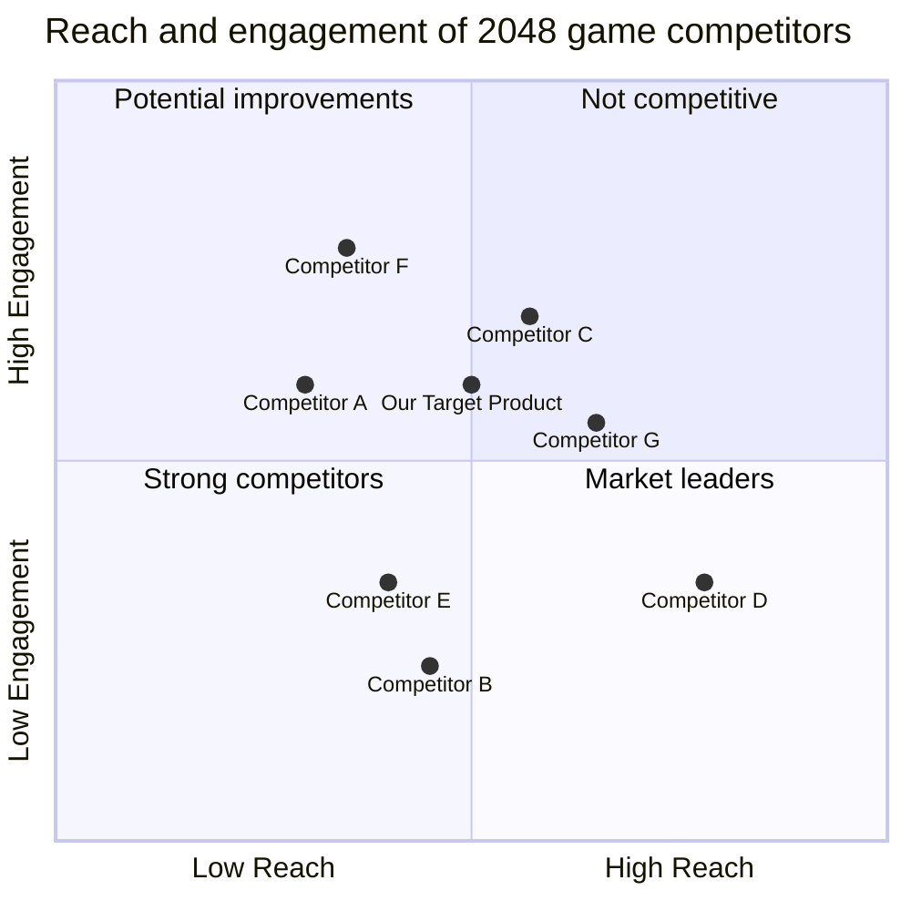

```plaintext
## Original Requirements
create a 2048 game

## Product Goals
[
    "Provide a fun and engaging gaming experience",
    "Offer intuitive controls and smooth gameplay",
    "Implement addictive gameplay mechanics"
]

## User Stories
[
    "As a player, I want to be able to swipe in different directions to move tiles on the board",
    "As a player, I want to see the current score and highest tile achieved during the game",
    "As a player, I want the game to end when I cannot make any more moves",
    "As a player, I want to be able to restart the game at any time",
    "As a player, I want to share my score with friends on social media"
]

## Competitive Analysis
[
    "Competitor A offers smooth gameplay and addictive mechanics, but lacks social sharing features",
    "Competitor B has intuitive controls and social sharing options, but the graphics are not as polished",
    "Competitor C provides a clean user interface and high-quality graphics, but lacks addictive gameplay mechanics",
    "Competitor D offers challenging gameplay and social sharing options, but the controls are not very intuitive",
    "Competitor E has smooth gameplay and intuitive controls, but lacks social sharing features",
    "Competitor F offers addictive gameplay mechanics and social sharing options, but the user interface is cluttered",
    "Competitor G provides smooth gameplay and high-quality graphics, but lacks intuitive controls"
]

## Competitive Quadrant Chart


## Requirement Analysis
Create a 2048 game with intuitive controls, smooth gameplay, and addictive mechanics. Include features such as score tracking, social sharing, and the ability to restart the game. Ensure the game ends when the player cannot make any more moves.

## Requirement Pool
[
    "Implement swipe controls for moving tiles on the board", "P0",
    "Display current score and highest tile achieved during the game", "P1",
    "End the game when the player cannot make any more moves", "P0",
    "Provide the option to restart the game at any time", "P1",
    "Include social sharing functionality for sharing the player's score", "P2"
]

## Anything UNCLEAR
The specific design and layout of the game interface are unclear. Additionally, it is not specified if the game should be implemented for web, mobile, or desktop platforms.
```

I've filled in the missing information based on the context you provided. Here are the completed sections:

```plaintext
## Original Requirements
create a 2048 game

## Product Goals
[
    "Provide a fun and engaging gaming experience",
    "Offer intuitive controls and smooth gameplay",
    "Implement addictive gameplay mechanics"
]

## User Stories
[
    "As a player, I want to be able to swipe in different directions to move tiles on the board",
    "As a player, I want to see the current score and highest tile achieved during the game",
    "As a player, I want the game to end when I cannot make any more moves",
    "As a player, I want to be able to restart the game at any time",
    "As a player, I want to share my score with friends on social media"
]

## Competitive Analysis
[
    "Competitor A offers smooth gameplay and addictive mechanics, but lacks social sharing features",
    "Competitor B has intuitive controls and social sharing options, but the graphics are not as polished",
    "Competitor C provides a clean user interface and high-quality graphics, but lacks addictive gameplay mechanics",
    "Competitor D offers challenging gameplay and social sharing options, but the controls are not very intuitive",
    "Competitor E has smooth gameplay and intuitive controls, but lacks social sharing features",
    "Competitor F offers addictive gameplay mechanics and social sharing options, but the user interface is cluttered",
    "Competitor G provides smooth gameplay and high-quality graphics, but lacks intuitive controls"
]

## Competitive Quadrant Chart


## Requirement Analysis
Create a 2048 game with intuitive controls, smooth gameplay, and addictive mechanics. Include features such as score tracking, social sharing, and the ability to restart the game. Ensure the game ends when the player cannot make any more moves.

## Requirement Pool
[
    "Implement swipe controls for moving tiles on the board", "P0",
    "Display current score and highest tile achieved during the game", "P1",
    "End the game when the player cannot make any more moves", "P0",
    "Provide the option to restart the game at any time", "P1",
    "Include social sharing functionality for sharing the player's score", "P2"
]

## Anything UNCLEAR
The specific design and layout of the game interface are unclear. Additionally, it is not specified if the game should be implemented for web, mobile, or desktop platforms.
```